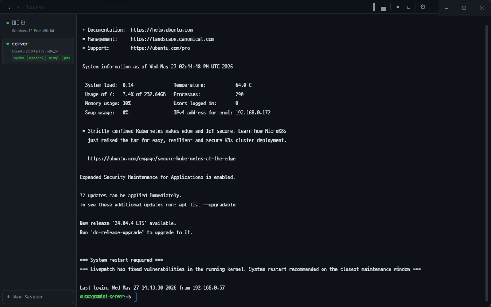

# >_ Lounge

> A terminal session manager for SSH servers, local shells, and AI agent workflows.

Lounge is not just a terminal emulator.  
It's a persistent workspace where your servers, projects, and agents are always ready to connect.

Like an airport lounge — where agents wait, connections stay warm, and work begins the moment you arrive.

<br />



<br />

## Features

### Session Management
- **Saved profiles** — Store SSH servers and local terminals by name
- **Auto-connect** — Open designated sessions automatically on startup
- **Collapsible sidebar** — Three states: expanded, icons-only, hidden
- **Persistent storage** — SQLite-backed profiles survive restarts

### SSH
- Password, private key, and key file path authentication
- Automatic `keyboard-interactive` handling (Ubuntu, Debian, etc.)
- **Auto-reconnect** — retries on disconnect (up to 5 attempts, exponential backoff)
- **Port forwarding** — configure local → remote TCP tunnels per profile
- **ProxyJump** — connect through a jump host with separate credentials

### Check-in
- On connect, automatically scans the remote server in the background
- Shows OS, architecture, detected tools, and active services in the sidebar
- Works on Linux, macOS, and Windows SSH targets
- Local terminals show the host OS without any subprocess overhead

### Terminal
- **Split panes** — unlimited horizontal/vertical splits per tab (`Ctrl+Shift+H` / `V` / `W`)
- **In-pane search** — `Ctrl+F` to search terminal output with match highlighting
- Set a start directory per local profile (one terminal per project)
- Font family and size settings (10 built-in fonts + custom)

### Log Capture
- Per-session command + output logging, stored in SQLite
- **Log search** — `Ctrl+Shift+F` full-text search across all sessions (FTS5)
- Configurable retention period with one-click purge

### Quality of Life
- `Ctrl+C` — copies selected text; sends SIGINT when nothing is selected
- `Ctrl+V` / right-click — paste from clipboard
- Desktop notification when a long-running command finishes (> 5s)
- CJK IME input support

<br />

## Stack

| Layer | Technology |
|---|---|
| Shell | Electron |
| UI | React + Vite |
| Terminal | xterm.js |
| SSH | ssh2 |
| PTY | node-pty (ConPTY) |
| DB | better-sqlite3 |

<br />

## Getting Started

```bash
npm install
npm run dev
```

> **Windows recommended** — uses node-pty's ConPTY backend for best compatibility.

### Building

```bash
# Requires Windows Developer Mode enabled (for symlink support)
set CSC_IDENTITY_AUTO_DISCOVERY=false
npm run dist
```

Outputs to `release/`:
- `Lounge Setup x.x.x.exe` — NSIS installer
- `Lounge x.x.x.exe` — portable executable

<br />

## License

MIT © [duskagk](https://github.com/duskagk)
